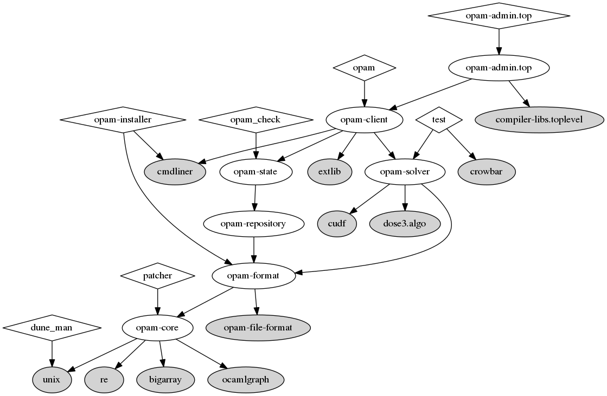

# dune-deps 

Show the internal dependencies in your OCaml/Reason/Dune project.

Input: the root folder of your project

Output: a graph in the dot format

Example:

```
$ dune-deps | tred > deps.dot
$ dot -Tpng deps.dot -o deps.png
```

This is the graph we obtain for the
[source code of opam](https://github.com/ocaml/opam):



Installation
==

From opam:

```
$ opam update
$ opam install dune-deps
```

From the git repo:

```
$ make
$ make test
$ make install
```

Rendering the graph
==

For producing a 2D image of the graph, we rely on the `dot` command
from [Graphviz](https://www.graphviz.org/).

Additionally, it is often desirable to remove excessive edges to make
the graph more readable. We consider "excessive" an edge that can be
removed without changing the reachability from a node to another. This
transformation is called
[transitive reduction](https://en.wikipedia.org/wiki/Transitive_reduction)
and is performed by `tred`, normally installed as part of the Graphviz
suite.

Project status
==

Dune-deps was initiated by Martin Jambon.
It is distributed free of charge under the terms of a
[BSD license](LICENSE).

Software maintenance takes time, skill, and effort. Please
contribute to open-source projects to the best of
your ability. Talk to your employer about it today.
