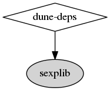

# dune-deps [](https://app.circleci.com/pipelines/github/mjambon/dune-deps)

Show internal dependencies in your OCaml/Reason/Dune project.

Input: the root folder of your project

Output: a graph in the dot format

Example:

```
$ dune-deps | tred | dot -Tpng > deps.png
```

Running dune-deps on itself gives us this dependency graph:


This is the graph we obtain for the
[source code of opam](https://github.com/ocaml/opam), an elaborate
project of over 50K lines of code:


Installation
==

From opam:

```
$ opam update
$ opam install dune-deps
```

From the git repo:

```
$ make
$ make test
$ make install
```

Rendering the graph
==

For producing a 2D image of the graph, we rely on the `dot` command
from [Graphviz](https://www.graphviz.org/).

Additionally, it is often desirable to remove excessive edges to make
the graph more readable. We consider "excessive" an edge that can be
removed without changing the reachability from a node to another. This
transformation is called
[transitive reduction](https://en.wikipedia.org/wiki/Transitive_reduction)
and is performed by `tred`, normally installed as part of the Graphviz
suite.

Usage scenarios
==

How big is this project?
--

Produce a graph for the whole project without knowing anything about
it. This graph may be unreadable, but it gives a sense of the
project's complexity. Use the canonical command pipeline for this:

```
$ cd my-project
$ dune-deps | tred | dot -Tpng > deps.png
```

It can be useful to keep this graph embedded in your rich-text readme.
The markdown syntax, for including an image in a `README.md` file, is:

```

```

How are these specific components related?
--

As a project grows, its graph becomes wider. Some basic dependencies
may be used directly by many components, resulting in many edges all
tangled up.
[Transitive reduction](https://en.wikipedia.org/wiki/Transitive_reduction)
as performed by `tred` helps with that but is not always sufficient.

For better results, you can build a graph only for selected
components. Specify `dune` files or selected
subfolders directly on the command line. Something like this:

```
$ dune-deps src/lib-foo src/lib-bar src/lib-baz | tred | dot -Tpng > deps.png
```

What uses or is used by a specific component?
--

The `--hourglass` or `-h` option restricts the graph to the
dependencies and reverse dependencies of the specified libraries.
This is useful to eliminate independent components that may clutter
the view.

This example restricts the graph to the dependencies and reverse
dependencies of the `opam-client` library:

```
$ dune-deps -h opam-client | tred | dot -Tpng > opam-client.png
```


Compare this with the full graph of the opam project shown above.

Other options are provided for showing only the dependencies, or only
the reverse dependencies. It is also possible to do so for multiple
nodes of interest. See `dune-deps --help` for details.

Is this external dependency really necessary?
--

You can see this by showing all the direct dependencies, i.e. a plain
run without transitive reduction:

```
$ dune-deps | dot -Tpng > deps.png
```

The resulting graph can be messy, but the number of arrows pointing to
the node of interest should give you the answer you're looking for.

Note that this assumes `dune` files are properly written with all the
direct dependencies listed. If some code uses a module `Foo` directly, the
library `foolib` providing `Foo` must be declared as a dependency. In
such case, declare dependencies as `(libraries foolib barlib)` even if
`barlib` itself depends on `foolib`.

Project status
==

Dune-deps was initiated by Martin Jambon.
It is distributed free of charge under the terms of a
[BSD license](LICENSE).

Software maintenance takes time, skill, and effort. Please
contribute to open-source projects to the best of
your ability. Talk to your employer about it today.
